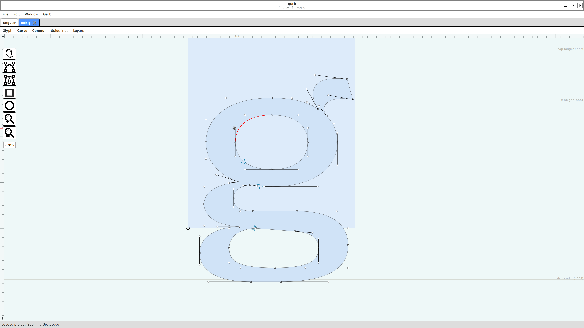

# `gerb`

1. _*gerb ʰ-_: [reconstructed Proto-Indo-European root](https://en.wiktionary.org/wiki/Reconstruction:Proto-Indo-European/gerb%CA%B0-), meaning _to carve_
2. `gerb`: a WIP font editor in `gtk3` and `rust`

## Introduction

`gerb` is an experimental, developed for fun GUI font editor. Still in prototype phase, it opens fonts in [UFOv3](https://unifiedfontobject.org/versions/ufo3/index.html) format but hasn't implemented saving modifications or exporting to `otf`/`ttf` files yet.

### Goals

- Fun
- Good UX not necessarily tied to prior art
- Reasonable performance
- Configurability
- Use visual feedback for all kinds of operations to inform the user of the current state (for example, a Bézier path tool that shows you the current curve's degree and progress).

### Roadmap to a minimum working prototype

- [ ] save modifications to disk ([Tracking issue #5](https://github.com/epilys/gerb/issues/5))
- [x] be able to create new paths/contours in a glyph ([Tracking issue #3](https://github.com/epilys/gerb/issues/3))
- [ ] be able to add/remove glyphs
- [ ] create new projects ([Tracking issue #4](https://github.com/epilys/gerb/issues/4))
- [x] {un,re}do (event sourcing) ([Tracking issue #2](https://github.com/epilys/gerb/issues/2))

## Running the demo

Expects a folder "font.ufo" to be defined in the command line:

```shell
cargo run --release -- -u ./font.ufo
```

I got mine from the `Regular` instance at the [Source Sans repository](https://github.com/adobe-fonts/source-sans).




### Dependencies

Needs `gtk-3`.

On Debian and relatives:

```shell
apt install libgtk-3-dev
```

On `macOS` you can install dependencies with `Homebrew`:

```shell
brew install librsvg gtk+3 gnome-icon-theme
```
